# 아이용돈관리 : 초중학생의 건전한 소비 습관 향성을 위한 용돈관리 서비스

초등학생 및 중학생을 위한  
**디지털 용돈 관리**, **퀘스트 기반 습관 향성**, **부모-자녀 소통형 금융 교육 서비스**

> 개발 기간: 2024.03.03 ~ 2024.04.11 (6주)  
> 프로젝트명: **Boney**
> 소스코드 브렌치: develop-backend(백엔드), develop-frontend(프론트엔드), release(배포)

---

## 목차

1. [기획 배경](#기획-배경)
2. [목적](#목적)
3. [주요기능 및 기술](#주요기능-및-기술)
4. [화면소개](#화면소개)
5. [서비스-아키테카](#서비스-아키테카)
6. [ERD](#ERD)
7. [명세서(기능,-API,-요구사항)](#명세서)
8. [화면-정의서](#화면-정의서)
9. [담당-역할](#담당-역할)

---

## 기획 배경

- 아이에게 용돈 관리와 용돈기입장의 중요성을 강조하고 있지만, 실제로 이를 꾸준히 실천하는 학생은 많지 않습니다.

- 부모들은 자녀에게 올바른 경제 관념을 심어주고 싶어 하지만, 구체적인 방법을 몰라 어려움을 겪고 있습니다.

- 아이가 좀 더 쉽고 재미있게 돈을 관리할 수 있도록, 그리고 부모가 보다 효과적으로 자녀를 경제적으로 교육할 수 있도록 돕기 위함입니다.

---

## 목적

1. 자녀의 자율적 소비 기록 및 습관 향성
2. 부모의 송금/퀘스트 보상 등을 통한 참여형 교육
3. 신용 점수 기반 대출 기능으로 책임감 있는 소비 교육 제공

---

## 주요기능 및 기술

### 주요 기능

- **카카오 소셜 로그인 + JWT 인증**
- **부모-자녀 연결 구조**
- **용돈 쇼금 / 정기 자동 이체**
- **퀘스트 기반 보상 시스템**
- **신용 점수 기반 대출 및 상환 환경**
- **AI 이상 거래 탑지 (FDS)**
- **월간 소비 및 보상 리포트 자동 생성**
- **실시간 푸시 알림 (FCM)**

### 기술 스택

- **Frontend**: React Native, TypeScript, Tailwind CSS
- **Backend**: Spring Boot 3.3.9, FastAPI, Spring Security, JPA, Redis
- **Infra**: AWS EC2, S3, RDS, Docker, Nginx, Jenkins
- **AI/FDS**: Isolation Forest, Scikit-learn
- **DB**: MySQL 8.3.0, QueryDSL

---

## 화면소개

### 로그인 / 회원가입

카카오 로그인을 통해 간편하게 회원가입 및 로그인을 할 수 있습니다.  

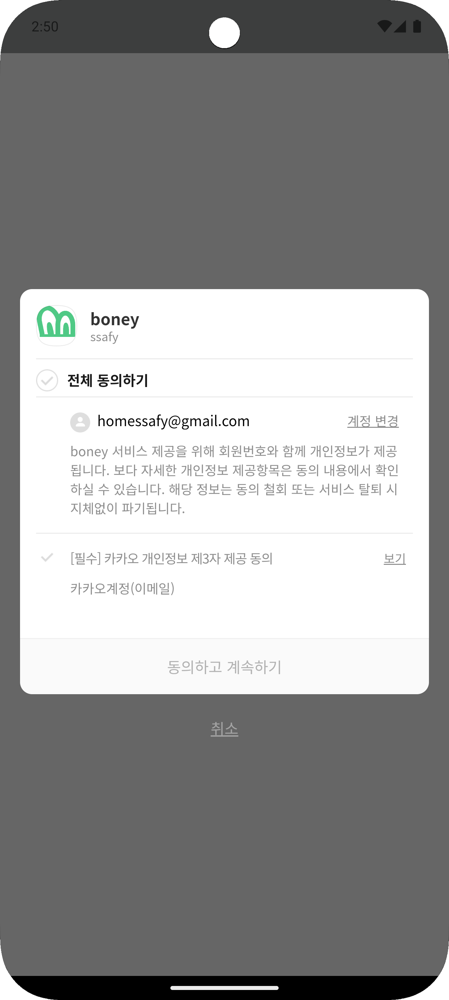

### 부모 메인페이지

부모는 자녀별 요약 정보, 퀘스트 현황, 대출 내역 등을 한눈에 확인할 수 있습니다.  
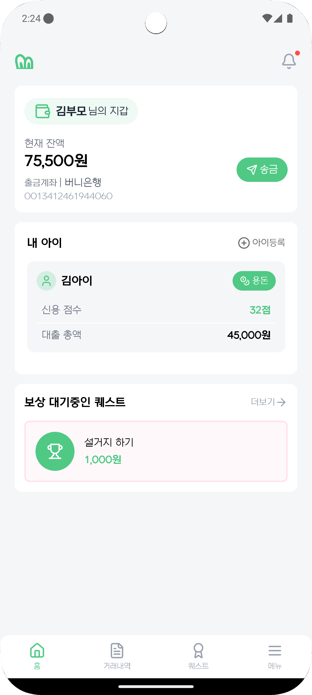

### 자녀 메인페이지

자녀는 자신의 계좌 잔액, 신용 점수, 퀘스트 요약 정보를 확인할 수 있습니다.  
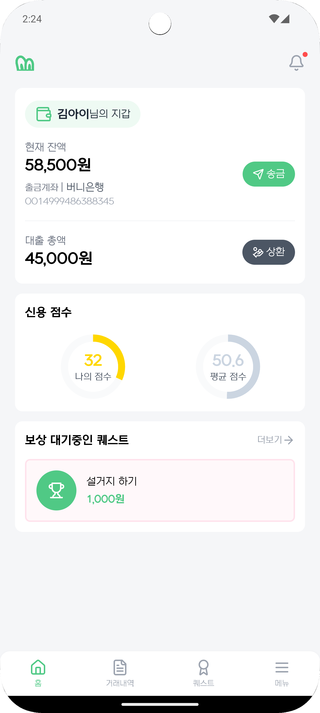

### 송금

송금 기능을 통해 간편하게 송금을 할 수 있습니다.  
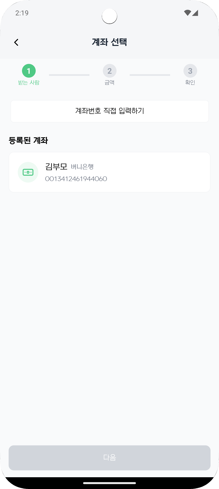
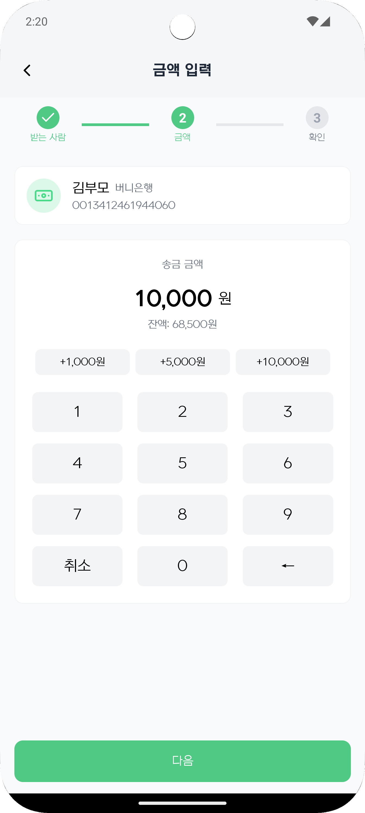
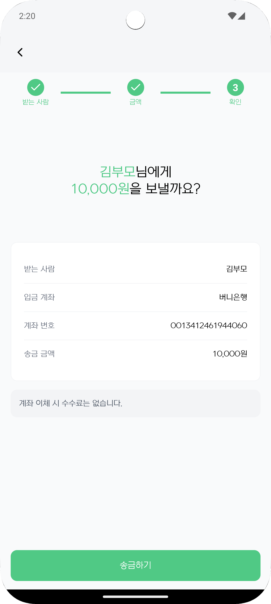

### 퀘스트

부모가 퀘스트를 생성하고 자녀는 이를 수행해 보상을 받을 수 있습니다.  
(예: 청소하기, 숙제하기 등)  

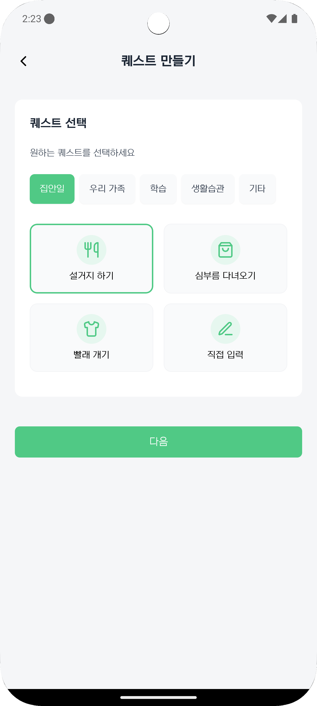
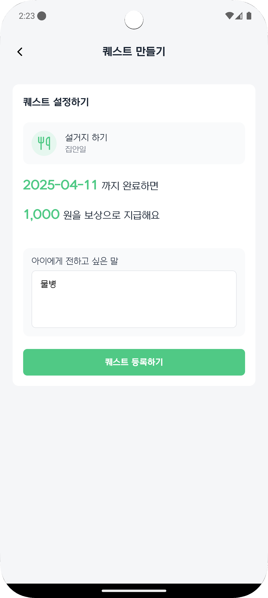
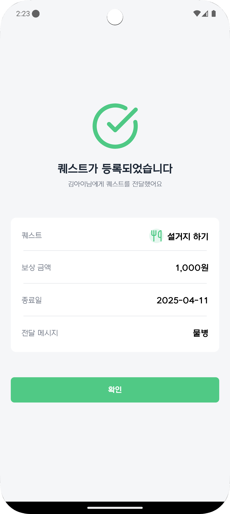

### 대출

자녀가 대출을 신청하고 전자서명 후, 부모가 승인하는 과정을 거칩니다.  
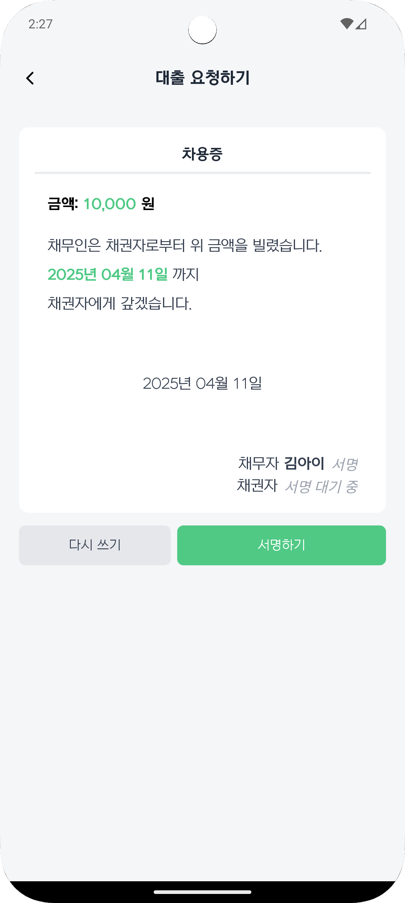

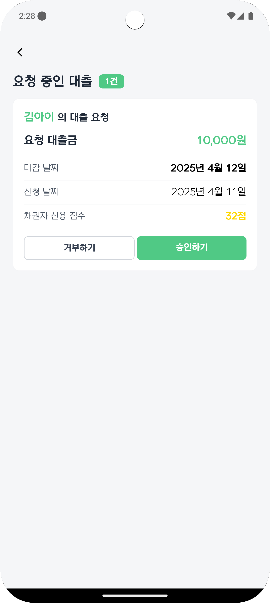
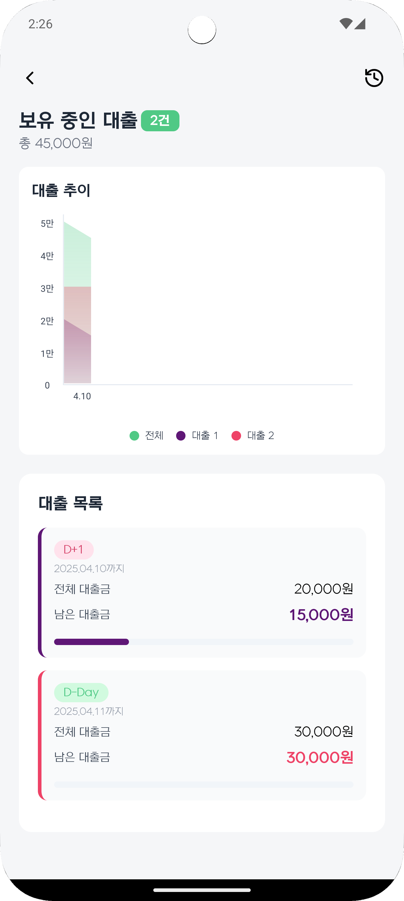

### 마이페이지

회원 정보 및 연결된 계좌 정보를 확인할 수 있습니다.  
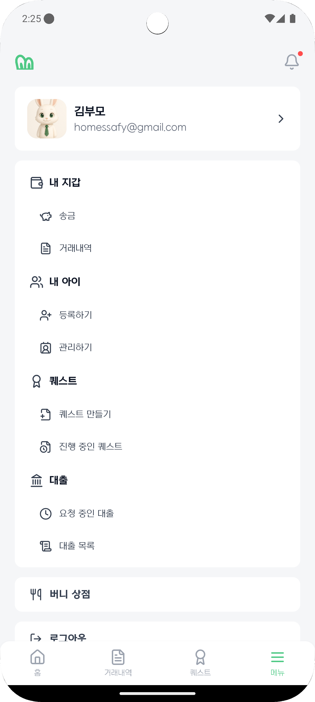
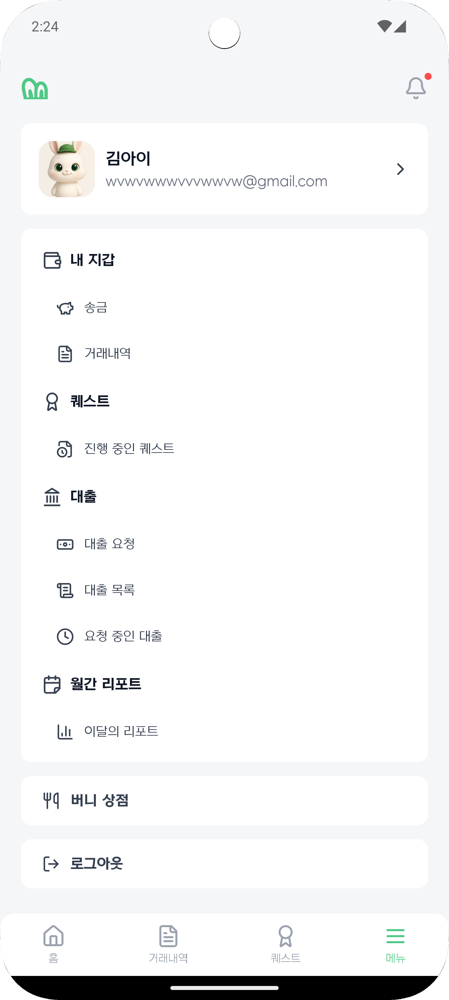

### 리포트

지출 카테고리 분포와 수입/지출 비교, 최근 추이를 월간 리포트에서 확인할 수 있습니다.
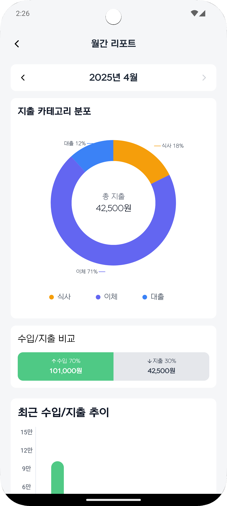

---

## ERD

  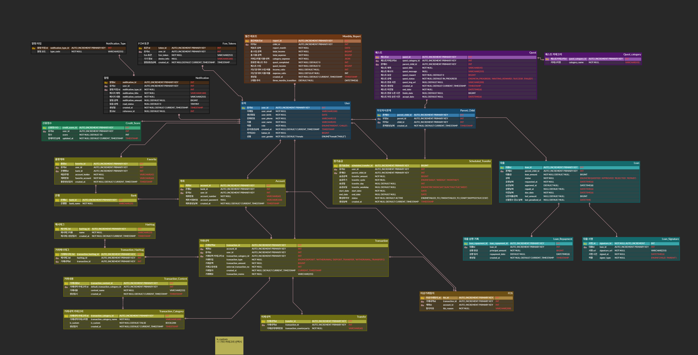

---

## 명세서

- 👉 [요구사항 정의서](https://www.notion.so/1b250f0f3cea80e2b86dfec0d7f24d35?pvs=21)
- 👉 [API 명세서](https://www.notion.so/1b250f0f3cea8036bf98e5d856435c29?pvs=21)

---

## 담당 역할

| 이름       | 포지션          | 주요 담당                                                |
| ---------- | --------------- | -------------------------------------------------------- |
| **최현만** | Infra, Frontend | Docker, Jenkins, Nginx 배포 구성, 정기 송금, 전자서명 UX |
| **백기찬** | Backend         | 인증, 대출, 전자서명 API 개발                            |
| **김세림** | Backend         | 거래, 계좌, 알림, 퀘스트 API 개발                        |
| **황대규** | Backend, AI     | 정기 송금 이체, 통계 및 리포트 API, FDS 개발             |
| **이신욱** | Frontend        | 홈 화면, 알림, 거래 내역, 월간 레포트 UI/UX 개발         |
| **민선희** | Frontend        | 로그인, 퀘스트, 대출 UI/UX 개발                          |

---

## 주요 특장점 요약

- **보안과 실계정 금융 인증**: 싸피 API, 카카오 OAuth 2.0 기반 인증 시스템 적용
- **퀘스트 기반 경제 교육**: 일 → 보상 구조를 통한 가치 체득
- **신용 점수 시스템**: 0~100점 범위, 상환에 따라 점수 조정, 30점 무료 대출 제한
- **자동 리포트**: 월간 수입/지출 및 카테고리 분석 제공
- **FDS 시스템**: 이상 거래 패턴 학습 및 실시간 감지
- **자동화된 금융 활동**: 정기 이체, 상환 기한 점수 감점 등 Spring Scheduler 활용

---

